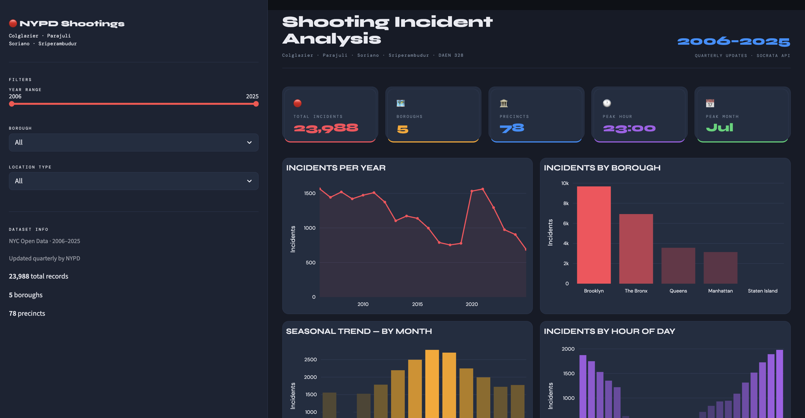

# NYPD Shooting Incident Data Pipeline

**Texas A&M University – DAEN 328 (Spring 2026)**
**Team:** William Colglazier, Mallika Parajuli, Ryan Soriano, Sharvi Sriperambudur

---

## Overview

This project implements a full-stack data engineering pipeline using NYPD shooting incident data from the NYC Open Data API. The system simulates a real-world workflow by extracting raw data, transforming it into a clean format, storing it in a PostgreSQL database, and serving insights through an interactive Streamlit dashboard.

* **Dataset:** ~23,000 shooting incidents (2006–present)
* **Source:** NYC Open Data (Socrata API)
* **Update Frequency:** Quarterly

---

## Pipeline Architecture

The pipeline is modular and fully automated using Docker Compose:

1. **Extract**
   Retrieves data from the Socrata API with pagination and stores raw responses.

2. **Transform**
   Applies structured cleaning functions including date parsing, type conversion, standardization, and duplicate handling.

3. **Load**
   Inserts cleaned data into a PostgreSQL database using a normalized schema.

4. **Visualize**
   A Streamlit dashboard queries the database and presents interactive charts, filters, and summary metrics.

---

## Database Design

The PostgreSQL database is initialized empty and populated automatically during pipeline execution.

* **incidents table:** stores core incident data (date, time, borough, etc.)
* **locations table:** stores precinct and geographic details

This separation supports cleaner queries and better organization of structured data.

---

## Dashboard Preview



---

## Running the Project

### 1. Clone the repository

```bash
git clone https://github.com/sharvi-s/nypd-shooting-pipeline.git
cd nypd-shooting-pipeline
```

### 2. Set up environment variables

```bash
cp .env.sample .env
```

Fill in required values (API key, database credentials).

### 3. Run the pipeline

```bash
docker-compose up --build
```

### 4. Access the dashboard

Open: http://localhost:8501

The first run may take ~1–2 minutes to fetch and load data. Subsequent runs start instantly.

---

## Tech Stack

* **Python**
* **PostgreSQL**
* **SQLAlchemy**
* **Streamlit**
* **Plotly**
* **Docker & Docker Compose**
* **NYC Open Data API**

---

## Team Contributions

* **William Colglazier:** API extraction and data retrieval logic
* **Mallika Parajuli:** Data transformation and cleaning functions
* **Ryan Soriano:** Database schema design and data loading pipeline
* **Sharvi Sriperambudur:** Streamlit dashboard and data visualization

---

## Future Improvements

* Add real-time data updates or streaming ingestion
* Enhance geospatial visualizations with interactive maps
* Optimize query performance with indexing and caching
* Deploy dashboard for public access

---
